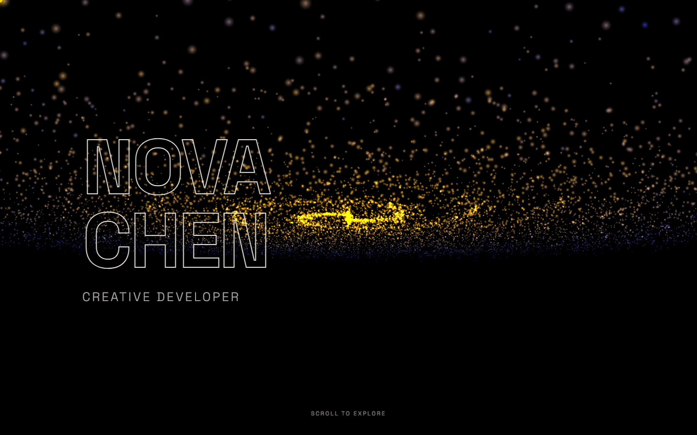
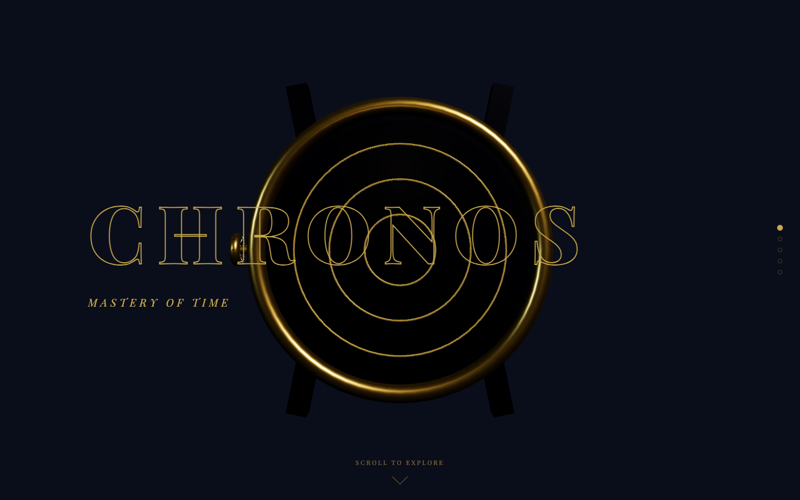
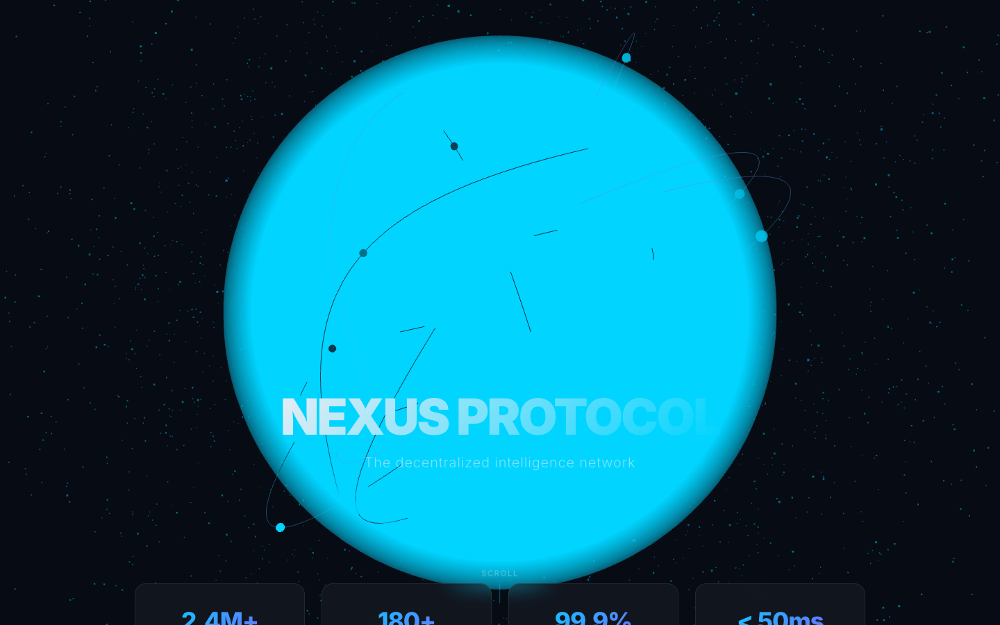
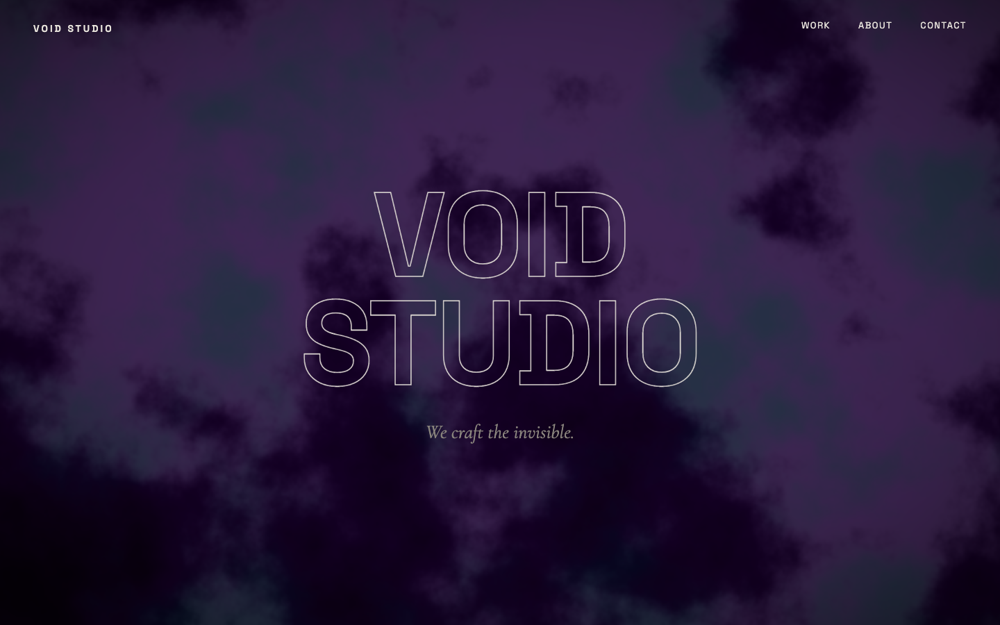
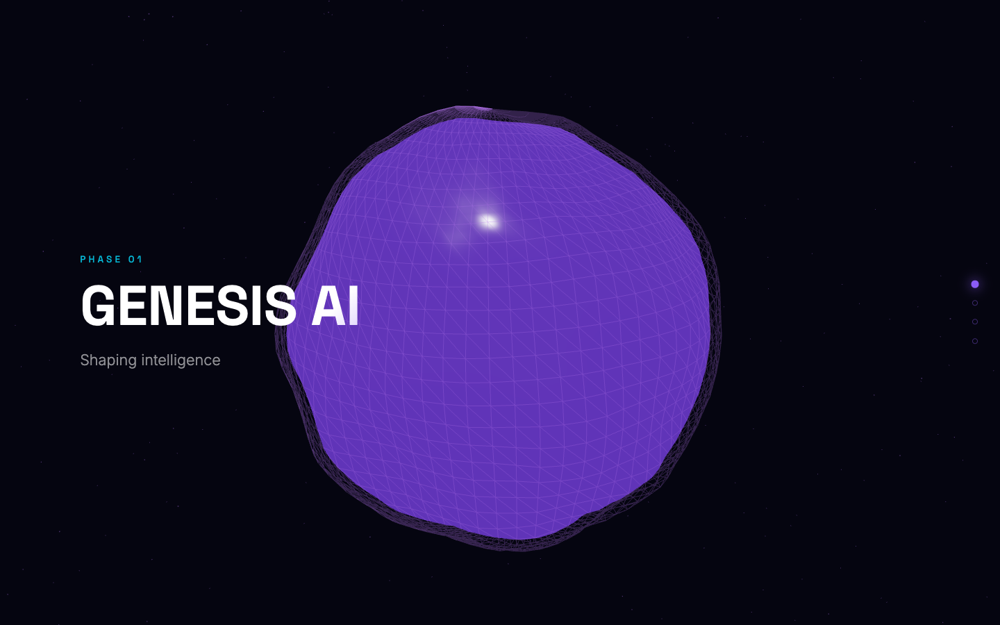
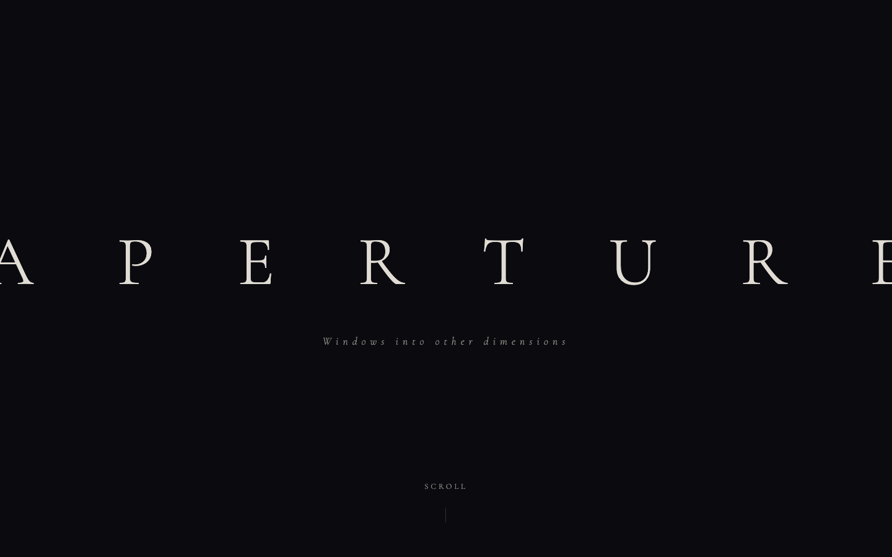

# Web 3D Master

**Stop dropping spinning cubes into pages. Start building immersive 3D web experiences.**

This plugin transforms Claude into a 3D web development expert. It covers the full spectrum -- from CSS 3D transforms to Three.js scenes to custom GLSL shaders to scroll-driven image sequences -- with production-ready patterns extracted from 96 award-winning 3D websites.

> "Would Dogstudio or Unseen Studio ship this?" -- The standard this plugin holds you to.

## The 3D Web Spectrum

Not every "3D website" needs WebGL. The best 3D sites choose the right tool:

| Approach | Cost | When to Use |
|---|---|---|
| CSS 3D transforms | Free | Card tilts, flip animations, parallax layers |
| Pre-rendered image sequences | Low | Apple-style scroll product reveals |
| Alpha-channel video | Low | Cinematic 3D character overlays |
| Spline embeds | Medium | Quick interactive 3D heroes |
| Three.js with matcaps | Medium | Stylized 3D without lighting cost |
| Three.js with PBR | High | Photorealistic interactive scenes |
| Custom GLSL shaders | High | Unique visual effects, backgrounds |
| Three.js + physics | Very High | Interactive simulations |

## What's Inside

| File | Content |
|---|---|
| `SKILL.md` | Decision framework, technology guide, stack selection |
| `threejs-patterns.md` | Scene setup, model loading, materials, lighting, camera, animation |
| `shaders-and-effects.md` | GLSL patterns, post-processing, visual effects |
| `scroll-driven-3d.md` | GSAP ScrollTrigger + Three.js, image sequences, sprite sheets, Lenis |
| `particles-and-physics.md` | Particle systems, instanced rendering, Rapier/Cannon physics |
| `performance-guide.md` | Optimization pipeline, LOD, Draco, mobile fallbacks, budgets |
| `css-3d-patterns.md` | CSS-only 3D: tilt cards, flip cards, carousels, cubes, parallax |

### Key Patterns Include

- Scroll-driven GLTF animation playback (Superlist)
- Matcap materials for lighting-free 3D (Superlist)
- Pre-rendered image sequence scroll animation (Zoox, Apple-style)
- Alpha-channel video overlays with dual-codec pipeline (ChainGPT Labs)
- Sprite-sheet 3D animation (Hanai World)
- Cursor-proximity font-weight 3D effect (Jack Redley)
- Spline + Webflow scroll binding (STR8FIRE)
- CSS 3D tilt cards with depth layers (Rick Waalders)
- GPU particle systems with custom shaders
- Instanced rendering for 100K+ objects (Offscreen Canvas)
- R3F + Drei patterns (Float, Environment, ContactShadows)
- Fresnel edge glow, holographic, noise displacement shaders
- Rapier and Cannon-ES physics integration
- Performance budgets and mobile fallback strategies

## Installation

### Claude Code

```bash
/plugin marketplace add MickeyAlton33/web-3d-master
/plugin install web-3d-master
/reload-plugins
```

### Cursor

Automatically detected via `.cursor-plugin/plugin.json`.

### GitHub Copilot

Detected via `.github/plugin/plugin.json`.

## Usage

This plugin activates **on demand**. Invoke it when you need 3D expertise:

```
/web-3d-master -- Build a scroll-driven 3D product showcase
```

```
Use web-3d-master to create a Three.js particle background
```

```
Use web-3d-master to add a 3D model viewer to this React app
```

### The Decision Framework

When activated, the skill evaluates:

1. **GOAL** -- What role does 3D play? (Hero / Product / Background / Interactive)
2. **FIDELITY** -- Photorealism or stylized? (Photo → pre-render. Stylized → runtime)
3. **INTERACTIVITY** -- Does the user control 3D? (Yes → Three.js. No → image sequence)
4. **SCROLL-BINDING** -- Should 3D respond to scroll? (Yes → GSAP ScrollTrigger)
5. **PERFORMANCE** -- Target devices? (Mobile → CSS 3D. Desktop → WebGL)
6. **STACK** -- Framework? (React → R3F. Vanilla → Three.js. No-code → Spline)

## Examples

The `examples/` directory contains 6 Three.js concept sites. Download any HTML file and open it -- they're fully self-contained (Three.js loaded from CDN).

| Preview | Concept | 3D Technique |
|---|---|---|
|  | **Galaxy Portfolio "Nova Chen"** | 15K particle galaxy with custom GLSL, differential rotation, scroll-driven zoom, cursor trail |
|  | **Luxury Watch "CHRONOS"** | Procedural Three.js watch geometry, 5-stage scroll-driven rotation, gold matcap lighting |
|  | **Data Globe "NEXUS PROTOCOL"** | Holographic wireframe globe, 12 animated data arcs, 3K particles, drag-to-rotate |
|  | **Shader Agency "VOID STUDIO"** | Full-screen FBM noise shader, GPGPU-style hover ripple distortion, mix-blend cursor |
|  | **Morphing Mesh "GENESIS AI"** | Geometry morphing between 4 forms on scroll, particle bursts, wireframe overlay |
|  | **Portal Windows "APERTURE"** | 4 shader portals (ocean, starfield, aurora, nebula) in 3D picture frames |

## Research Sources

Patterns extracted from 96 3D websites featured on Lapa.ninja, including:

**Award Winners:** Superlist (Awwwards SOTM), Zoox (Webby Award), Hanai World (Awwwards SOTD), Three.js Journey, ChainGPT Labs

**Creative Studios:** Dogstudio, Unseen Studio, MILL3, GC Studio, Reform Collective

**Portfolios:** Dorian Lods, Abhishek Jha, Clay Boan, Jack Redley, Hardik Bhansali, Rick Waalders, Filippo Ruffini

**Products:** Worldcoin, Jasper, Story Protocol, Cosmos Network, Spline Design

## Contributing

Add patterns extracted from real 3D websites with production-ready code. See existing files for the format.

## License

[MIT](LICENSE)
